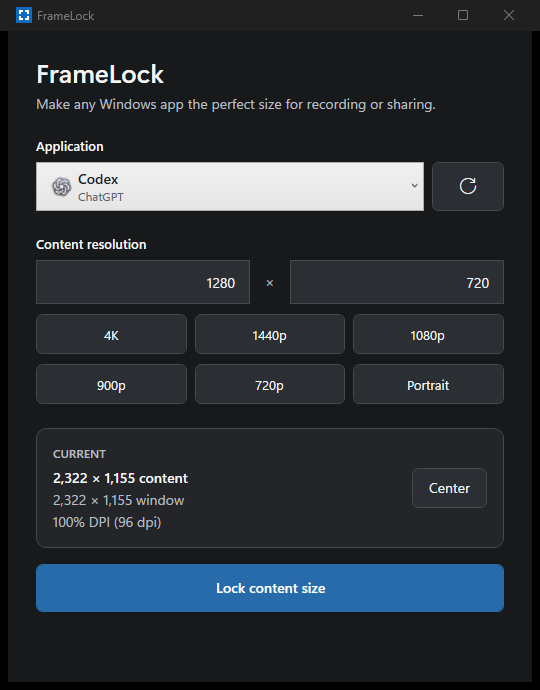

# FrameLock

> Make any Windows app the perfect size for recording or sharing.

FrameLock is a small Windows utility that resizes another application's **content area** to an exact pixel resolution and keeps it there. It is designed for predictable OBS captures, screen sharing, screenshots, demos, and recordings—not for recording by itself.



## Features

- Finds useful visible desktop application windows and shows their application names and icons.
- Sizes the selected window's **client/content area**, accounting for its title bar, borders, menu, window styles, and DPI.
- Verifies the measured client size after every resize and applies bounded corrections when Windows reports a mismatch.
- Includes 4K, 1440p, 1080p, 900p, 720p, portrait, and custom resolutions.
- Keeps the client size locked with WinEvent notifications plus a low-frequency safety check—there is no busy loop.
- Lets the target move normally while only correcting unwanted size changes.
- Restores the target's previous placement on unlock when the original HWND and process identity are still valid.
- Pauses safely while a target is minimized and resumes after restore.
- Unlocks safely if the target closes or recreates its window instead of crashing or restoring a recycled HWND.
- Centers the target in its current monitor's work area.
- Remembers the last resolution and per-application choices in `%LOCALAPPDATA%\FrameLock\settings.json`.
- Uses native keyboard interaction, visible focus states, high-contrast colors, application icons, and system light/dark appearance at launch.

FrameLock does not capture, record, stream, or create a virtual display.

## Requirements

- Windows 10 version 1809 or newer, or Windows 11
- [.NET 10 SDK](https://dotnet.microsoft.com/download/dotnet/10.0) to build from source
- x64 Windows is the validated v1 environment

FrameLock runs at the current user's integrity level. To resize an application running as administrator, FrameLock generally must also run as administrator.

## Build and run

From a PowerShell prompt in the repository root:

```powershell
dotnet restore FrameLock.slnx
dotnet build FrameLock.slnx -c Release --no-restore
dotnet run --project src/FrameLock.App/FrameLock.App.csproj -c Release --no-build
```

The solution has no third-party package dependencies. WPF and all Win32 interop support come from the installed .NET Windows Desktop SDK.

### Create a release package

```powershell
.\tools\Build-Release.ps1 -RunIntegrationTests
```

The script restores and builds the Release configuration, runs the tests, publishes the application, and creates `artifacts\FrameLock-1.0.0-windows.zip` with a neighboring SHA-256 checksum file. Omit `-RunIntegrationTests` for a package build that runs only the deterministic tests.

Extract the archive and run `FrameLock.exe`. Keep the published files together when copying the application. This framework-dependent build requires the .NET 10 Desktop Runtime on the destination computer. FrameLock v1 does not yet ship an installer, single-file package, or code-signed binary.

## Usage

1. Open the application you want to size.
2. Launch FrameLock and select that application window.
3. Choose a preset or enter a custom content width and height.
4. Select **Lock content size**.
5. Move or use the target normally. If it changes size, FrameLock returns its client area to the requested resolution.
6. Select **Center** when you want the target centered on its current monitor.
7. Select **Unlock** to stop constraining it and restore its previous placement when it is still safe to do so.

The **Current** card distinguishes the measured content size from the larger outer window size and shows the target window's DPI.

Keyboard users can tab through every control, use the underlined access keys with `Alt`, press `Enter` for the primary lock action, and press `Esc` to unlock while the locked view is active.

## Architecture

| Project | Responsibility |
| --- | --- |
| `FrameLock.Core` | Resolution validation, sizing math, lock lifecycle reduction, restore identity policy, and JSON preferences |
| `FrameLock.Windows` | Window discovery, Win32 interop, exact client sizing, monitor centering, icon lookup, WinEvent hooks, and the lock engine |
| `FrameLock.App` | Compact WPF user interface, system theme mapping, keyboard/accessibility behavior, and application state |
| `FrameLock.Tests` | Dependency-free deterministic tests and opt-in Windows integration tests |
| `FrameLock.TestHarness` | A DPI-aware WPF target that reports its client pixels and intentionally resizes, minimizes, restores, or closes itself |

FrameLock declares Per-Monitor V2 awareness. Sizing begins with the target's measured client-to-outer delta, falls back to `AdjustWindowRectExForDpi` when a useful measurement is unavailable, calls `SetWindowPos`, then measures `GetClientRect` again. Corrections are bounded and an exact mismatch becomes a user-facing error rather than a false success.

Lock mode listens for target location, lifecycle, and minimize events with `SetWinEventHook`. Events are coalesced before measurement, self-triggered feedback is suppressed by exact-size checks, and a 1.2-second watchdog covers lost or coalesced events at negligible idle cost. Unlock waits for any active correction before restoring placement, which prevents late resize races.

## Testing

Run deterministic logic and persistence tests:

```powershell
dotnet run --project tests/FrameLock.Tests/FrameLock.Tests.csproj -c Release
```

Run the full Windows dogfood suite (it opens and closes local test windows):

```powershell
dotnet build FrameLock.slnx -c Release
dotnet run --project tests/FrameLock.Tests/FrameLock.Tests.csproj `
  -c Release `
  --no-build `
  -- --integration
```

The integration suite verifies exact measured client areas at:

- 1280 × 720
- 1920 × 1080
- 2560 × 1440
- 1080 × 1920
- 1234 × 777 custom

It also verifies persistent correction after a target resizes itself, the WinEvent path correcting before the watchdog, original placement restoration, minimize/restore behavior, discovery, centering, and safe target closure.

To refresh the README screenshot after a UI change, launch FrameLock and run:

```powershell
.\tools\Capture-Window.ps1 -TargetProcessId <FrameLockProcessId> -OutputPath docs\screenshot.png
```

## Known limitations

- Some applications enforce fixed sizes, aspect ratios, or monitor-dependent maximum tracking sizes. FrameLock reports the measured mismatch when an exact client area cannot be achieved.
- Elevated or protected applications may reject resize requests from a non-elevated FrameLock process.
- If an application destroys and recreates its top-level HWND, FrameLock unlocks safely; v1 does not automatically attach to the replacement window.
- Theme changes made while FrameLock is open take effect the next time it launches.
- Per-monitor DPI behavior is implemented deliberately, but the automated environment currently validates one physical DPI at a time.
- v1 has no crosshair picker, Stage/capture window, virtual display driver, tray mode, installer, auto-update, or code signing.

## Privacy

FrameLock is entirely local. It has no accounts, analytics, telemetry, network service, or cloud component. The only user data it writes is the local resolution preference file described above.
